# Project Allotment Portal — Workflow Diagrams

How **Student**, **Supervisor**, **Reviewer**, and **Coordinator** work — and where they meet — shown as simple box diagrams (same style as a login → dashboard → actions flow).

---

## Complete project flow (all four pillars)

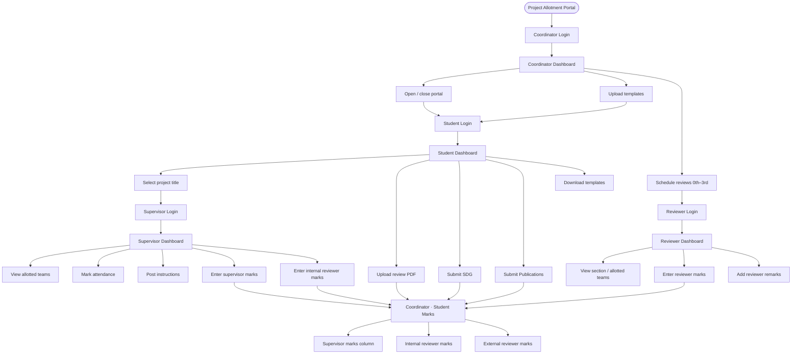

---

## 1. Student pillar

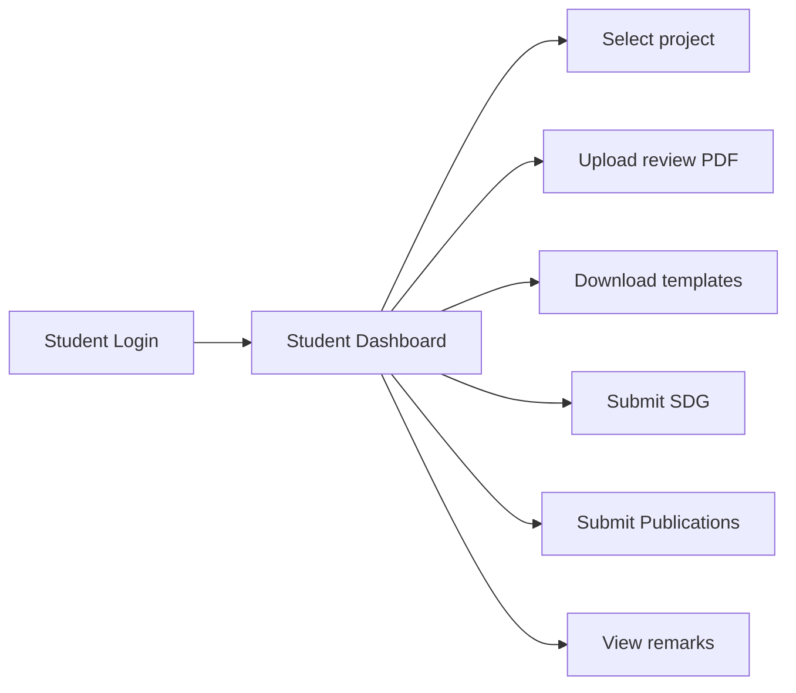

**Vertical version**

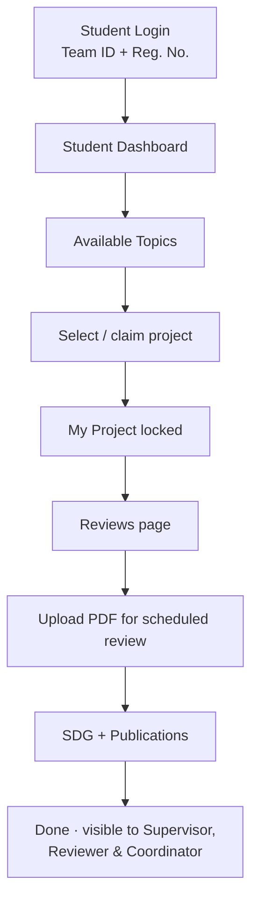

---

## 2. Supervisor pillar

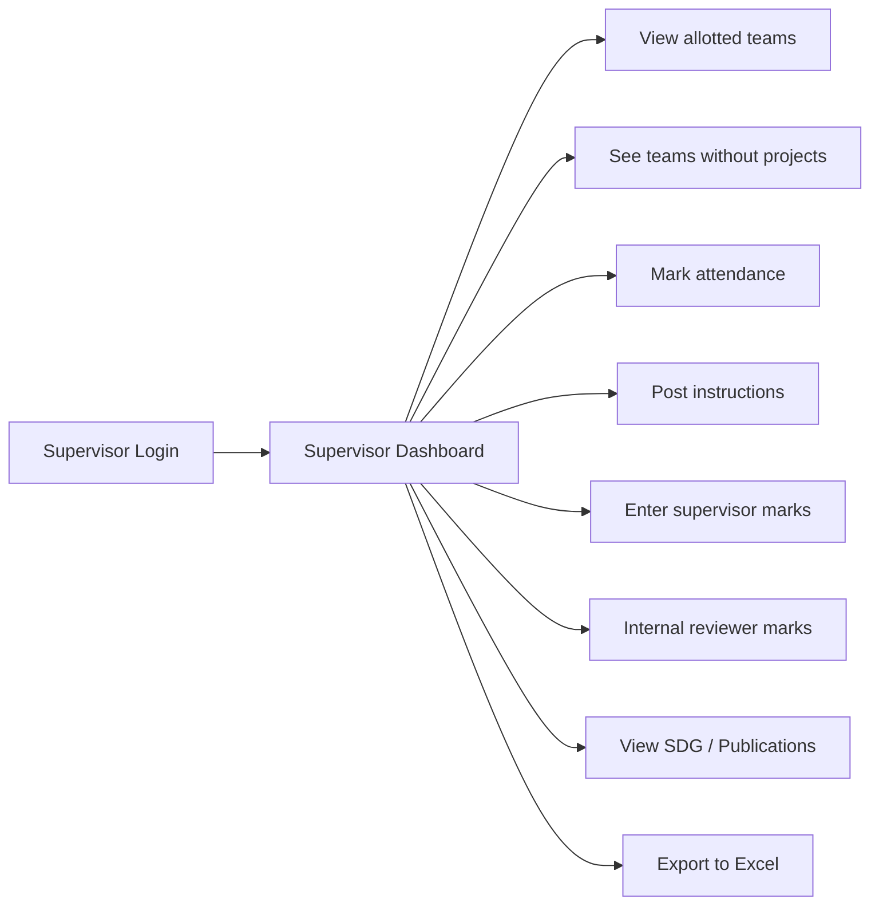

**Vertical version**

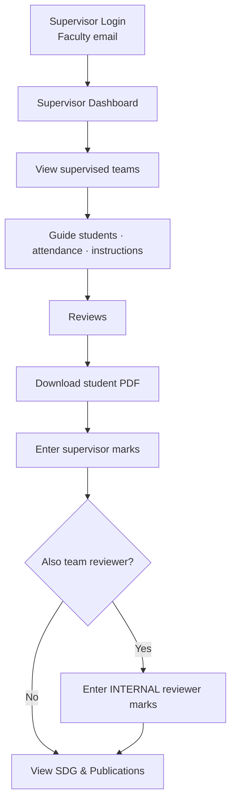

---

## 3. Reviewer pillar

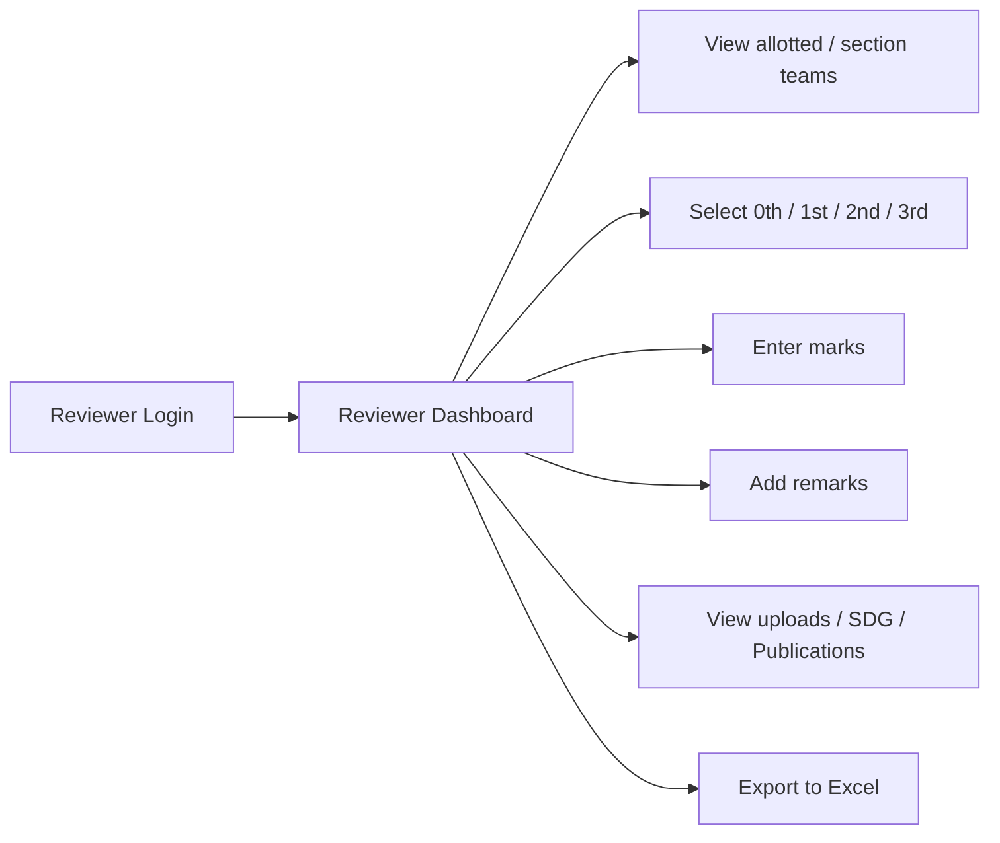

**Vertical version**

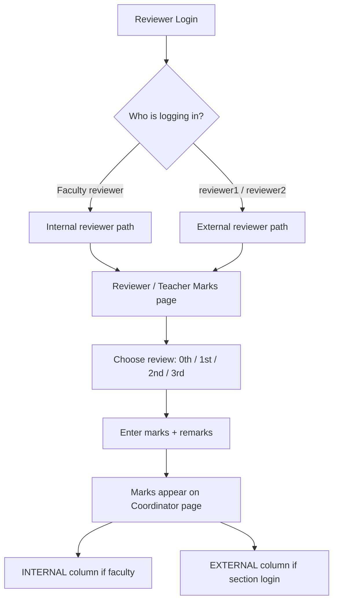

---

## 4. Coordinator pillar

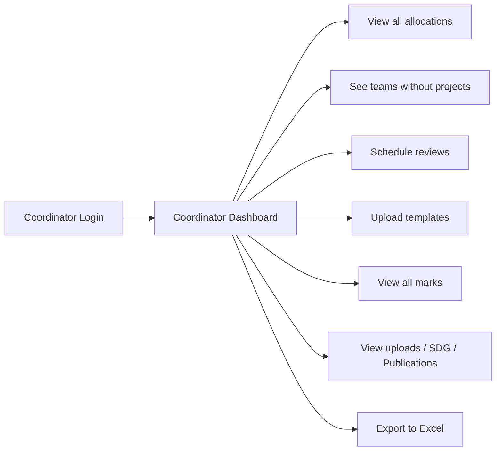

**Vertical version**

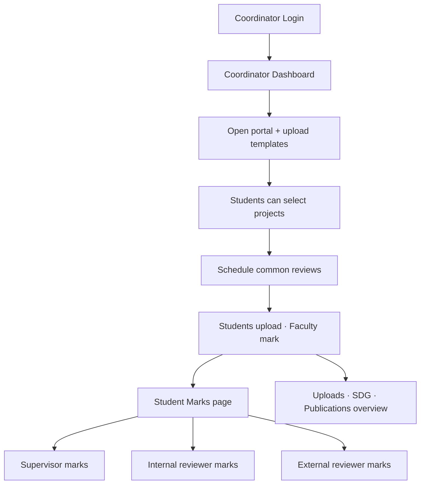

---

## Where the four pillars meet (interconnection)

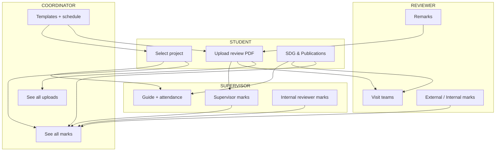

---

## Marks meeting point (Coordinator view)

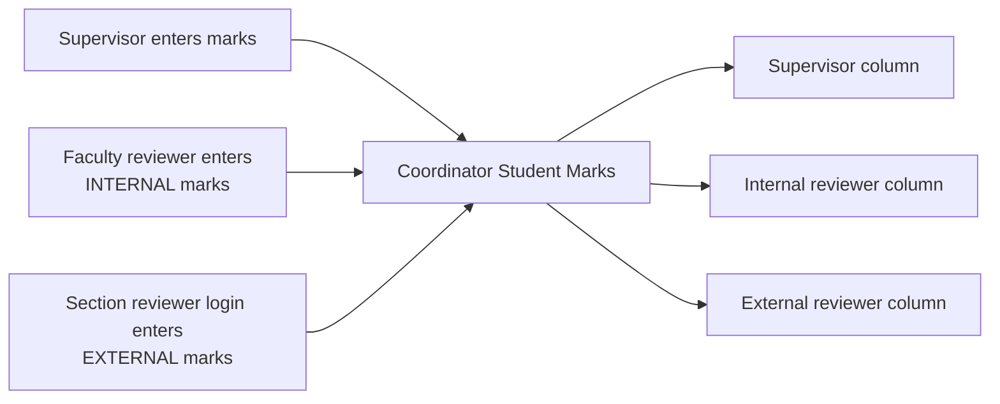

**Mark fields**

| Review | Fields | Max |
|--------|--------|-----|
| **0th** | Novelty · Abstract · SDG | 25 |
| **1st / 2nd / 3rd** | Feasibility · Proposed Methodology · Background · Literature Survey · Reference Paper | 50 (10 each) |

---

## One story top to bottom

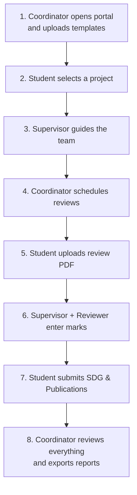

---

## Login cheatsheet

| Pillar | Login tab | Example |
|--------|-----------|---------|
| Student | Student | Team ID `27A01` + Reg. No. |
| Supervisor | Supervisor | Faculty email |
| Reviewer | Reviewer | `reviewer1@gmail.com` (A&B) · `reviewer2@gmail.com` (C&D) |
| Coordinator | Coordinator | Coordinator email |

---

## Tech & run locally

| Layer | Stack |
|-------|--------|
| Frontend | React + Vite + TypeScript + Tailwind |
| Backend | Supabase |
| Hosting | Vercel |

```bash
npm install
cp .env.example .env
npm run dev
```

Live: [https://project-portal-rouge.vercel.app](https://project-portal-rouge.vercel.app)

---

## License

MIT
